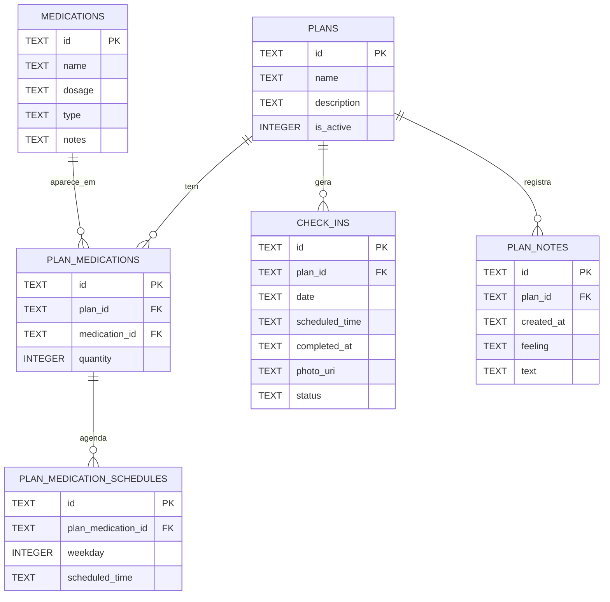

# Relacao do Banco de Dados

Notas:

- `plans` representa o tratamento.
- `plan_medications` representa um remedio dentro de um plano, incluindo a quantidade.
- `plan_medication_schedules` guarda uma linha por combinacao de remedio no plano, dia da semana e horario.
- Essa estrutura permite agendas diferentes por dia. Exemplo: segunda a sexta `08:00` e `20:00`, sabado apenas `12:00`.
- `plan_medication_schedules` deve ser unico por `plan_medication_id`, `weekday` e `scheduled_time`.
- `check_ins` registra o status de um check-in para um plano, data e horario.
- `plan_notes` registra notas livres do plano com data/hora e sentimento.
